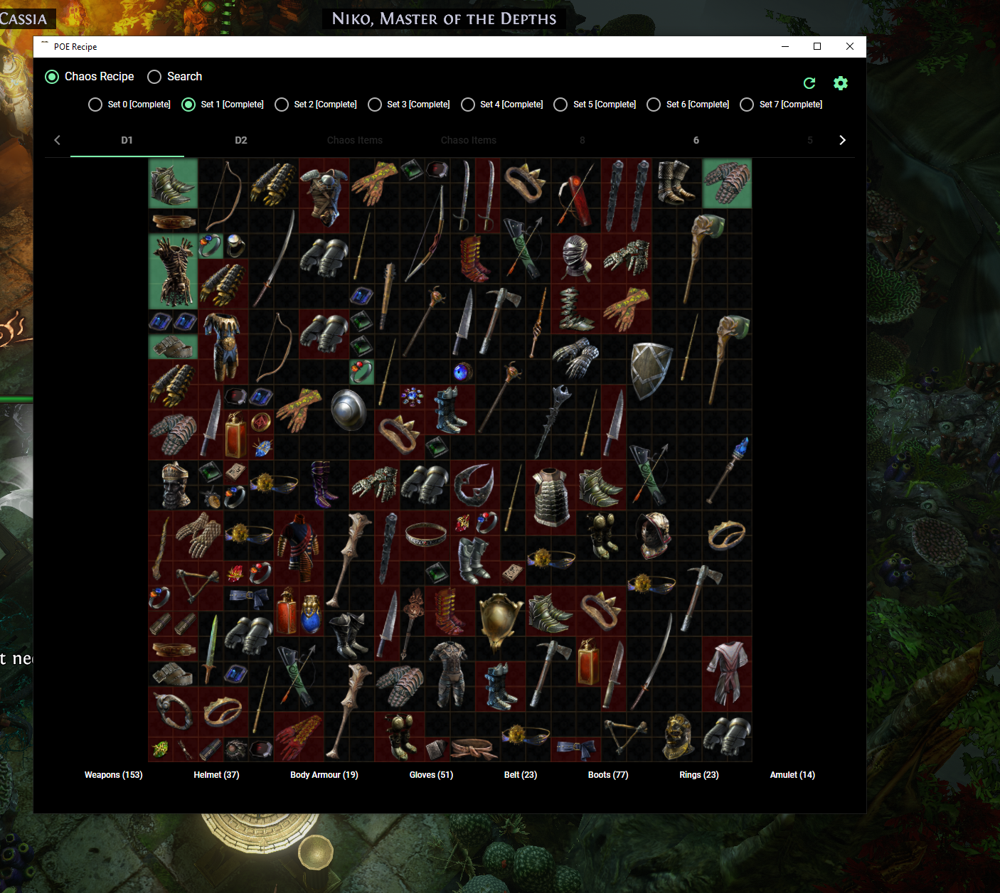
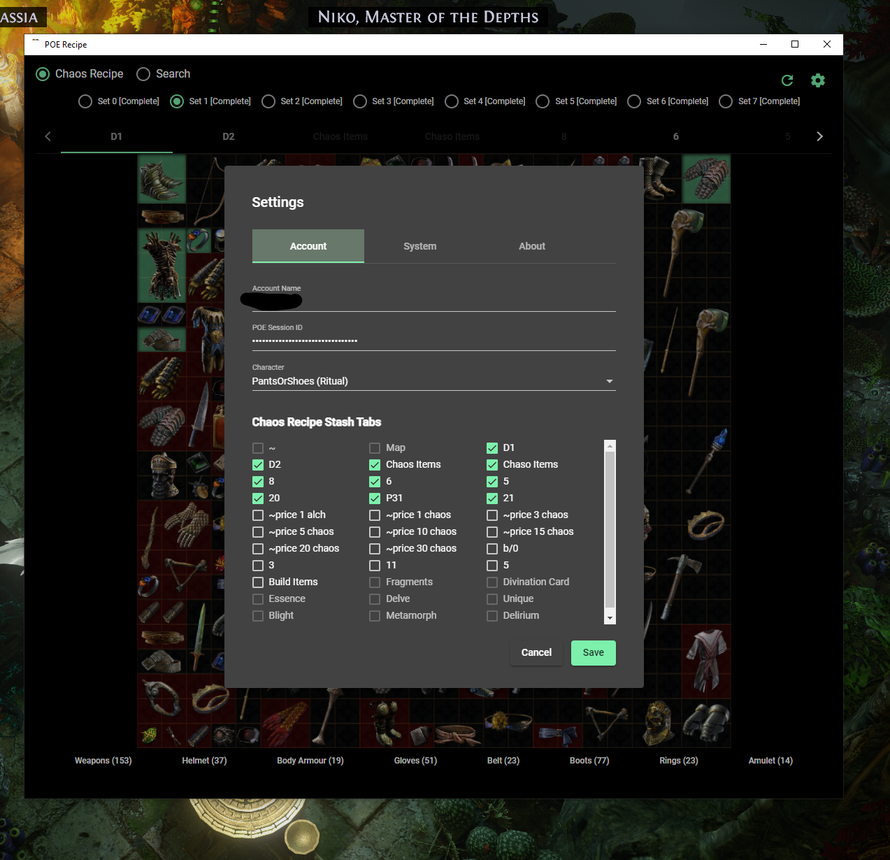
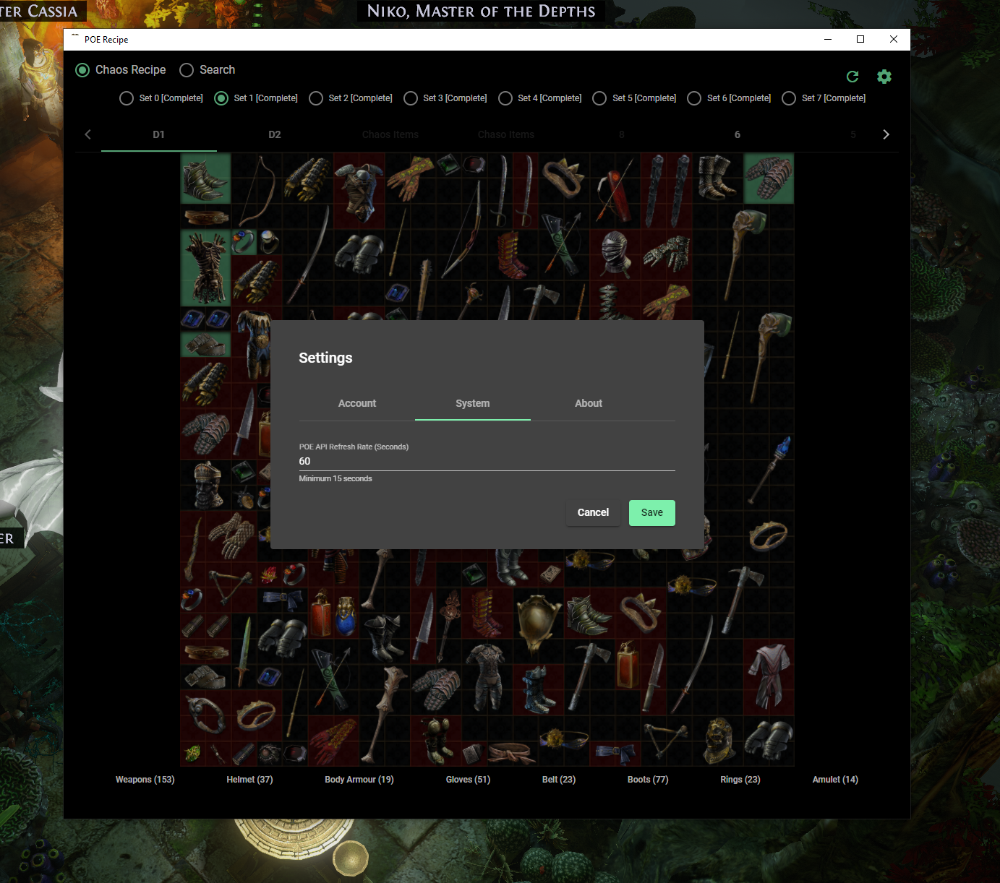
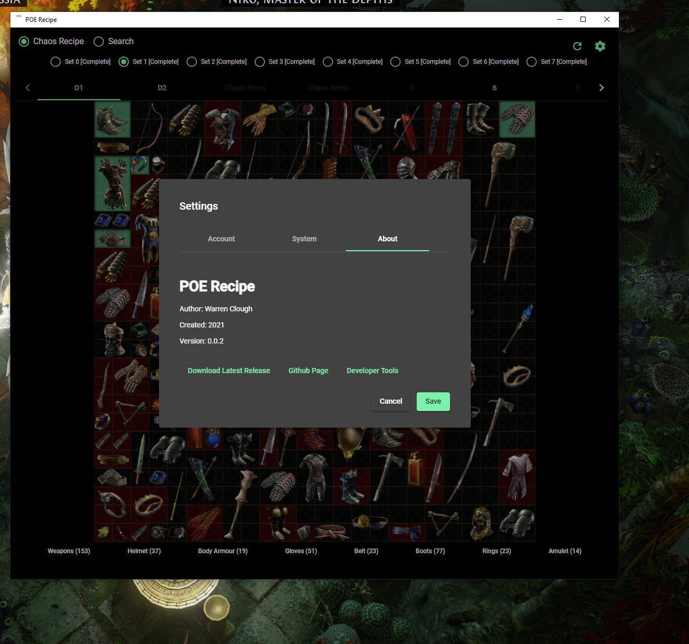
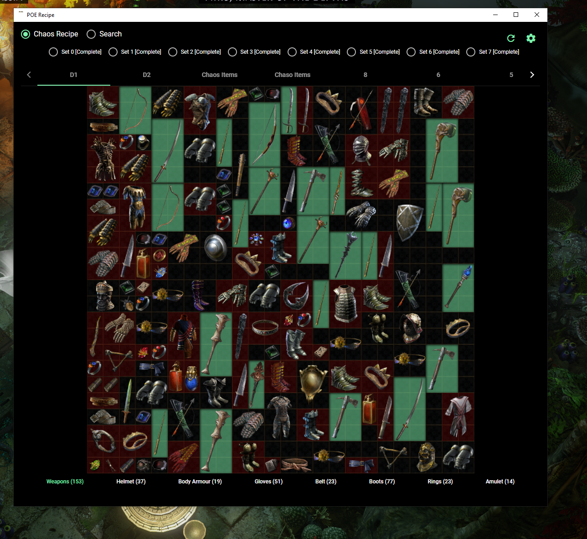

## About
This a app for highlighting items within your stash that can be used to make the chaos recipe. 

## Rationale 
So over the weekend I worked on this app that highlights item in your stash to make the chaos recipe. I was trying to use https://github.com/kosace/EnhancePoEApp, it worked initially and then stopped. Tried reaching out to the dev but that was unsuccessful and I needed something to automate the process. Thus the reason for this app.

## Download & Source
* Repo - https://github.com/CLOUGH/poe-recipe
* Download build - https://github.com/CLOUGH/poe-recipe/releases

## How to Use This App
* Visit the releases page and download the poe-recipe.*.exe (binary) 
* When app starts up click on the gear icon or the notification that comes up to enter your POE account info.
* You can get the POE session id by signing POE website. 
* After signing in you can press CTRL+SHIFT+I and a window inspector  will pop up for the page. 
* Go the the Tab name Application. On the left navbar under storage click on Cookies, then the POE url. If you have signed in POE you should see a item in the table named POESSID copy the value.
* In the application filed named fill in the field name "POE Session ID" paste the value copied in the previous step.
* Select the character you are currently using.
* Select the stashes you want to the application to check. 
* Save the changes.

If you get a blank screen at this point or nothing changes just click the refresh button or restart the app. If that didnt work refer to the section about "What to Do if Your having Issues" below.

## Build Instructions
This project is a Electron.JS and Angular project as such you need to have npm install to compile/develop for this app. 

To install first clone the project  `git clone https://github.com/CLOUGH/poe-recipe.git` and run `npm install` inside the clone project

The list of avaliable commands to run/complie the project can be found in the `package.json` file under scripts. The following would be the most common command required to regular development.
* `npm run ng` : To use the angular cli command line tool for generating components,models, service, etc. Eg. `npm run ng generate componet shared/components my-component`
* `npm start`:  To run the application in development mode to allow live updates while developing
* `npm run electron:build`: To compile application binary (.exe file)

## Dev Tools 
The app is built use Electron.js and Angular.  The base of the project was forked from https://github.com/maximegris/angular-electron. 

## Expect Bugs
Note. This is a quick and dirty approach because I wasn't planning on developing the tool since one already exist and I was planning on using it but quickly realize that something was wrong. Imp saying that to say, expect bugs and issues until iron them out.  But for the most part it seem to work. I  literally spend maybe a couple hours building it because  I was trying to play the new season.

## What to Do if Your having Issues.
If you are experiencing issues just leave a comment in the project under issues. Sometime refreshing will work to solve the problem. You can do that by entering CTRL+R.  To completely clear what is being stored/hard reset everything press CTRL+SHIFT+R. Closing reopening the app can sometimes work.
Hope that helps

## Screenshots

#Feedback
All feedbacks are welcomed. Just be kind

## Known Issue
* Some one handed sets are are only showing one weapon when it should be showing two.

## Change log
### Version 0.0.2
* Updated style of the app
* Added ability to now see when a update is available for the app
* Added ability to select type of items
* Add ability to automatically refresh the tab
* Added a error detail dialog to show the details of errors coming from the API.
* Resolve bugs with initial load of the app does load stash

